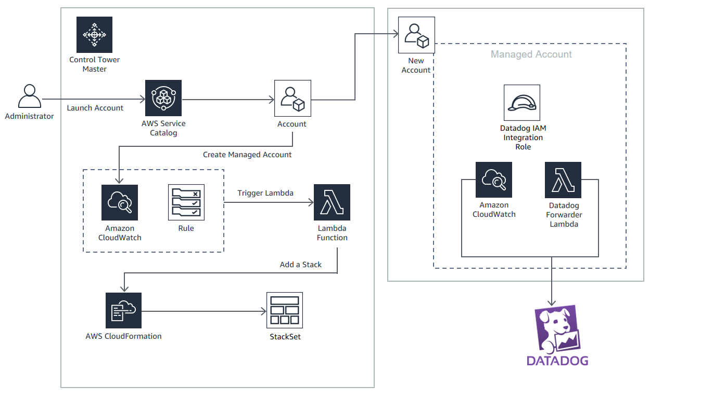

# Use AWS Control Tower with Datadog for Multi account AWS Cloud Monitoring and Analytics

* AWS Control Tower Lifecyle Integration with Datadog - Allow new or updated AWS accounts in an AWS Control Tower based AWS Organization to be managed automatically by Datadog

## How it Works

1. **Template: aws-datadog-controltower.yml**:
 * This template provisions infrastructure in the Control Tower Master account that allows creation of Datadog stack instances in Control Tower managed accounts whenever a new Control Tower managed account is added
 * Creates a Datadog Stackset in the Control Tower Master Account 
 * Provisions a CloudWatchEvents Rule that is triggered based on a Control Tower Lifecycle Event
 * Provisions a Lifecyle Lambda as a target for the CloudWatch Events Rule
 	- The Lifecycle Lambda deploys a Datadog stack in the newly added Control Tower managed account--thus placing that account under Datadog management
  * Lifecycle Lambda performs a POST on the Datadog AWS Integration API  - https://docs.datadoghq.com/api/v1/aws-integration/#create-an-aws-integration  that registers the new AWS managed account in Datadog and generates an External ID in response for this managed acccount. 
  	- Obtains AWS Account ID from the CreateManagedAccount or UpdateManagedAccount event. 
  	- Invokes Datadog External ID API with new Integration Role Name to be created and this Account ID to retrieve an External ID in response
  	- Uses Stack Instance Parameter Override when creating a stack instance for the managed account to override the generic External ID for the StackSet with this External ID generated by Datadog for the managed AWS account
 * The infrastructure provisioned by this template above allows for a Control Tower lifecycle event trigger specifically the CreateManagedAccount or UpdateManagedAccount events to:
	- Trigger the Lifecyle Lambda that creates Datadog stack instance in the managed account based on the Datadog stackset in the master account
 * All parameters that are needed for the Datadog Forwarder such as API Key and Secret are stored and retrieved from AWS Secrets Manager

 

## Solution Design

## Set up and Test

1. **Datadog - Initial Setup** 
 * From https://app.datadoghq.com/account/settings#api create an API Key
2. **AWS Setup - AWS Control Tower Master account**
 * Launch the aws-datadog-controltower.yml template in the AWS Control Tower Master account
 	-  Enter the API Key above. Accept all defaults
 	-  Ensure that a AWS CloudFormation StackSet is successfully created for the Datadog forwarder template
 	-  Ensure that a Amazon CloudWatch Events rule is successfully created with an AWS Lambda target to handle Control 
3. **Test - Create a Lifecycle Event - Add a managed account** 
 * From the AWS Control Tower Master Account:
    - Use Account Factory or quick provision or Service Catalog to create a  new managed account in the AWS Control Tower Organization OR
    - Use Service Catalog (AccountFactory Product) to update an existing managed account - for e.g. change the OU of an existing managed account
 	- This can take up to 30 mins for the account to be sucessfully created and the AWS Control Tower Lifecycle Event to trigger
 	- Login to the AWS Control Tower managed account - 
 		- Validate that an AWS CloudFormation stack instance has been provisioned that launches the Datadog Forwarder template in the managed account. 
 		- Validate that a Datadog Integration Role (DatadogIntegrationRole IAM role) has been created in the managed account.  This is a cross account role where the trusted account ID - 464622532012 corresponds to the Datadog control plane.

## Author 

Kanishk Mahajan
