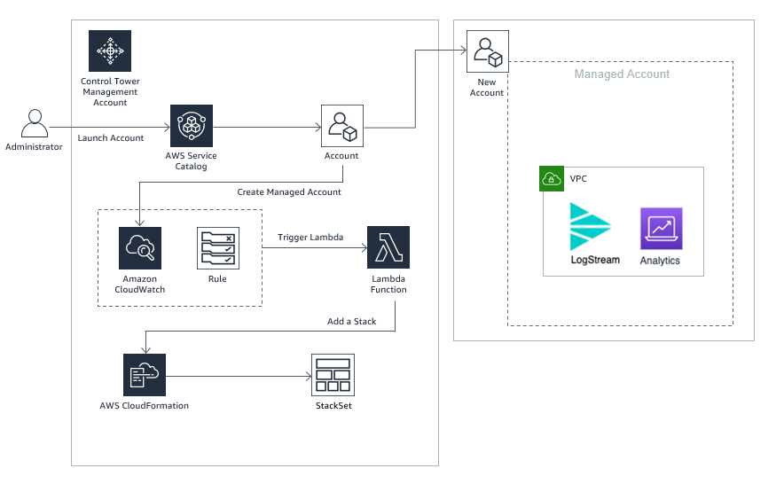

# Use AWS Control Tower with Cribl for Multi account AWS Cloud Monitoring and Analytics

* AWS Control Tower Lifecyle Integration with Cribl - Allow new or updated AWS accounts in an AWS Control Tower based AWS Organization to automatically deploy a Cribl Logstream stack.

## How it Works

1. **Template: aws-cribl-controltower.yml**:
 * This template provisions infrastructure in the Control Tower Master account that allows creation of a Cribl Logstream single instance in a Control Tower managed accounts whenever a new Control Tower managed account is added
 * Creates a Cribl Stackset in the Control Tower Master Account 
 * Provisions a CloudWatchEvents Rule that is triggered based on a Control Tower Lifecycle Event
 * Provisions a Lifecyle Lambda as a target for the CloudWatch Events Rule
 	- The Lifecycle Lambda deploys a Cribl Logstream stack in the newly added Control Tower managed account--thus placing that account under Cribl management

 

## Solution Design

## How to Install and Test

1. **AWS Setup - AWS Control Tower Managed account**
 * Launch the **aws-cribl-controltower.yml** template in the AWS Control Tower Managed account
 	-  Ensure that a AWS CloudFormation StackSet is successfully created
 	-  Ensure that a Amazon CloudWatch Events rule is successfully created with an AWS Lambda target to handle Control Tower lifecycle events
2. **Test - Create a Lifecycle Event - Add a managed account** 
 * From the AWS Control Tower Master Account:
    - Use Account Factory or quick provision or Service Catalog to create a  new managed account in the AWS Control Tower Organization OR
    - Use Service Catalog (AccountFactory Product) to update an existing managed account - for e.g. change the OU of an existing managed account
 	- This can take up to 30 mins for the account to be sucessfully created and the AWS Control Tower Lifecycle Event to trigger
 	- Login to the AWS Control Tower managed account - 
 		- Validate that an AWS CloudFormation stack instance has been provisioned that launches the Cribl Logstream single instance template in the managed account. 
 	

 
**kmmahaj@amazon.com**
