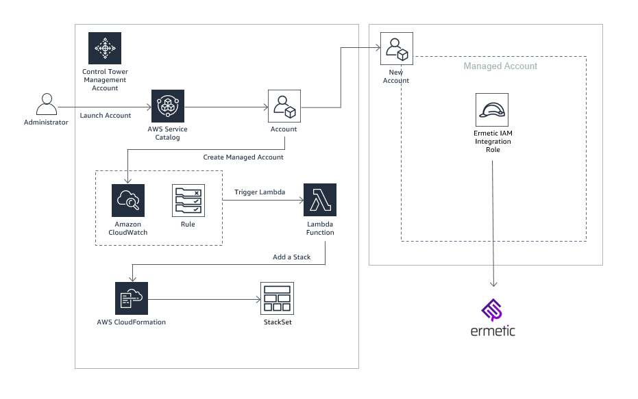

# Use AWS Control Tower with Ermetic for Multi account AWS permissions management

* AWS Control Tower Lifecyle Integration with Ermetic - Allow new or updated AWS accounts in an AWS Control Tower based AWS Organization to automatically deploy an Ermetic Integration role and register with Ermetic

## How it Works

1. **Template: aws-ermetic-controltower.yml**:
 * This template provisions infrastructure in the Control Tower Management account that allows creation of an Ermetic Integration IAM role in Control Tower managed accounts whenever a new Control Tower managed account is added
 * Creates an Ermetic Stackset in the Control Tower Management Account 
 * Provisions a CloudWatchEvents Rule that is triggered based on a Control Tower Lifecycle Event
 * Provisions a Lifecyle Lambda as a target for the CloudWatch Events Rule
 	- The Lifecycle Lambda deploys an Ermetic Integration role in the newly added Control Tower managed account--thus enabling Ermetic to access the managed account based on the permissions in the Integration role.

## Solution Design

## Prerequisite
1. Create an Amazon Simple Storage Service (Amazon S3) bucket with the following name: s3-ermetic-AccountId-Region where AccountId is your AWS Management account ID and Region is the AWS Region for the Control Tower set up in the management account. Upload the ermetic-managedaccount.yml template in this bucket. *This step will not be needed if you (ISV) are hosting the managed account template*

## How to Install and Test

1. **AWS Setup - AWS Control Tower Managed account**
 * Launch the **aws-ermetic-controltower.yml** template in the AWS Control Tower Managed account
 	-  Ensure that a AWS CloudFormation StackSet is successfully created
 	-  Ensure that a Amazon CloudWatch Events rule is successfully created with an AWS Lambda target to handle Control Tower lifecycle events
2. **Test - Create a Lifecycle Event - Add a managed account** 
 * From the AWS Control Tower Management Account:
    - Use Account Factory or quick provision or Service Catalog to create a  new managed account in the AWS Control Tower Organization OR
    - Use Service Catalog (AccountFactory Product) to update an existing managed account - for e.g. change the OU of an existing managed account
 	- This can take up to 30 mins for the account to be sucessfully created and the AWS Control Tower Lifecycle Event to trigger
 	- Login to the AWS Control Tower managed account - 
 		- Validate that an AWS CloudFormation stack instance has been provisioned that launches the Ermetic integration role template in the managed account. 
 	

 
