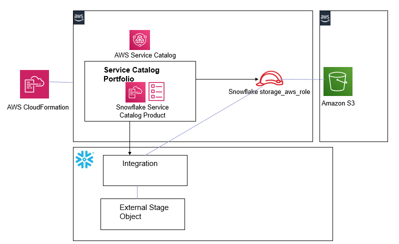

# Use AWS Service Catalog to automate Snowflake storage integration to access Amazon S3

1. Snowflake storage integrations are Snowflake objects that allow Snowflake to read and write data to Amazon S3. Snowflake storage integrations leverage AWS IAM to access S3. The S3 bucket is referenced by the Snowflake integration from an external (i.e. S3) Snowflake stage object
2. This solution provides full automation for Snowflake to access S3 using AWS Service Catalog. The solution implements an AWS Service Catalog product that automates Snowflake access to S3.
	1. The Service Catalog product provisions a Snowflake integration object, attaches an IAM role to it and creates a Snowflake stage for it that references S3. 

## How it Works

1. Provisions a Service Catalog Portfolio with a Service Catalog Product
2. The Snowflake Service Catalog Product takes a) Snowflake Connection information and b) S3 bucketname and prefix as input parameters and uses the *aws-snowflake-integrationobject.yml* CloudFormation template to create a Snowflake external stage object that enables access to S3.
	1. The Snowflake Service Catalog Product can be invoked as many times as needed. Each time it creates a Snowflake external stage object to access an S3 object/prefix based on the 2 input parameters (a and b) supplied above.
3. The template from 2:
	1. Provisions AWS Secrets Manager to store and retrieve Snowflake connection information
	2. Provisions a Lambda function that uses the Snowflake python connector:
		1. Creates a Snowflake integration object and obtains the Snowflake generated *AWS_IAM_USER_ARN* and *AWS_EXTERNAL_ID* from the Snowflake integration 
		2. Provisions an AWS IAM role that uses the Snowflake generated IAM Principal and External ID from 1 above
		3. Creates a Snowflake stage object that leverages the snowflake integration
	
 
## Solution Design

## Prerequisites

1. Create an S3 bucket: *s3-snowflakeintegration-accountId-region*. Replace accountId and region with the AWS Account ID and region of your AWS account. 
	1. Create a folder called *SnowflakeIntegration_Lambda* and upload the [SnowflakeIntegration_Lambda.zip](https://github.com/aws-samples/aws-datadog-controltower/blob/main/snowflake/lambda/SnowflakeIntegration_Lambda.zip) file. This lambda uses the Snowflake Python Connector to query and update Snowflake
	2. Upload the [snowflakelayer.zip](https://github.com/aws-samples/aws-datadog-controltower/blob/main/snowflake/layer/snowflakelayer.zip) in the root folder of this S3 object. This zip file packages the Snowflake connector as an AWS Lambda layer
	3. Create a folder called *template* and upload the [aws-snowflake-integrationobject.yml](https://github.com/aws-samples/aws-datadog-controltower/blob/main/snowflake/cft/aws-snowflake-integrationobject.yml) CloudFormation template. This template is provisioned when the Service Catalog Product is launched and it automates this integration for Snowflake to access S3  

## How to Install

**1-step install**
1. Launch the [aws-snowflakeintobj-servicecatalog](https://github.com/aws-samples/aws-datadog-controltower/blob/main/snowflake/cft/aws-snowflakeintobj-servicecatalog.yml) template. The template takes the S3 prerequisites bucket as a single parameter.
 	
## Test and Run

1. Navigate to the Service Catalog Console and launch the Snowflake Service Catalog Product.
	1. Provide Snowflake connection details and the external S3 bucket name and S3 prefix as parameters
2. Navigate to the AWS IAM console and check that a new IAM role has been provisioned that ends with *S3INTxxxxx* suffix. This suffix will also be the name of your new Snowflake integration object
3. From your Snowflake account (snowsql or console)-
	1. Validate that a new Snowflake integration object has been created (DESC INTEGRATION *'integrationobjectname'*)
	2. Obtain the *AWS_IAM_USER_ARN* and *AWS_EXTERNAL_ID* parameters from above and check that the AWS IAM role uses those as the trust relationship and external id parameters
	3. Validate that a new storage object has been created in Snowflake that references the S3 bucket and uses the integration object (SHOW STAGES IN ACCOUNT)
 	

 
